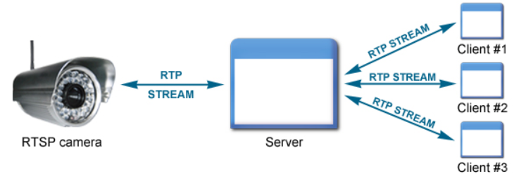

# Face Edge Project
# RTSP server in Ubuntu

상태: 메모
작성일시: 2021년 7월 29일 오후 1:53
작업자: 최동녘



V4L2 install

```bash
sudo apt install  v4l-utils# 현재 PC에 연결된 웹캠의 디바이스 파일을 확인합니다.
v4l2-ctl --list-devices
# 확인해보면 /dev/video0와 /dev/video1 두개의 디바이스 파일이 찾아지지만
# webnautes@webnautes-PC:~$ v4l2-ctl --list-devices
# Integrated Camera: Integrated C (usb-0000:00:14.0-6):
# /dev/video0
# /dev/video1
v4l2-ctl -d /dev/video0 --list-formats
# ioctl: VIDIOC_ENUM_FMT
# Type: Video Capture
# [0]: 'MJPG' (Motion-JPEG, compressed)
# [1]: 'YUYV' (YUYV 4:2:2)
```

FFmpeg install

```bash
sudo apt install ffmpeg
# RTST Server 모듈을 설치합니다. FFmpeg에서 rtsp로 영상을 전송하기 위해 필요한 모듈입니다.

sudo apt-get install libmoose-perl liburi-perl libmoosex-getopt-perl \
	             libsocket6-perl libanyevent-perl
sudo cpan AnyEvent::MPRPC::Client
sudo apt install git
git clone https://github.com/revmischa/rtsp-server
cd rtsp-server
perl Makefile.PL
make
make test
sudo make install

# 서버 프로그램 rtsp-server.pl의 위치를 찾아서 실행시킵니다.
# 포스트와 다른 위치에 서버 프로그램이 위치 할 수 있기때문에 위치를 확인하는게 좋을 듯합니다.
sudo find / | grep rtsp-server.pl
# find: ‘/run/user/1000/doc’: 허가 거부
# find: ‘/run/user/1000/gvfs’: 허가 거부
# find: ‘/run/user/125/gvfs’: 허가 거부
# /usr/local/share/perl/5.30.0/RTSP/rtsp-server.pl

sudo /usr/local/share/perl/5.30.0/RTSP/rtsp-server.pl
# Starting RTSP server, log level = 2

ffmpeg -f v4l2 -input_format yuyv422 -i /dev/video0 \
					-c:v libx264 \
					-f rtsp \
					rtsp://{insert User IP:pocam

# RTSP address -> rtsp://{User IP}/video (Do not insert port number)
```
